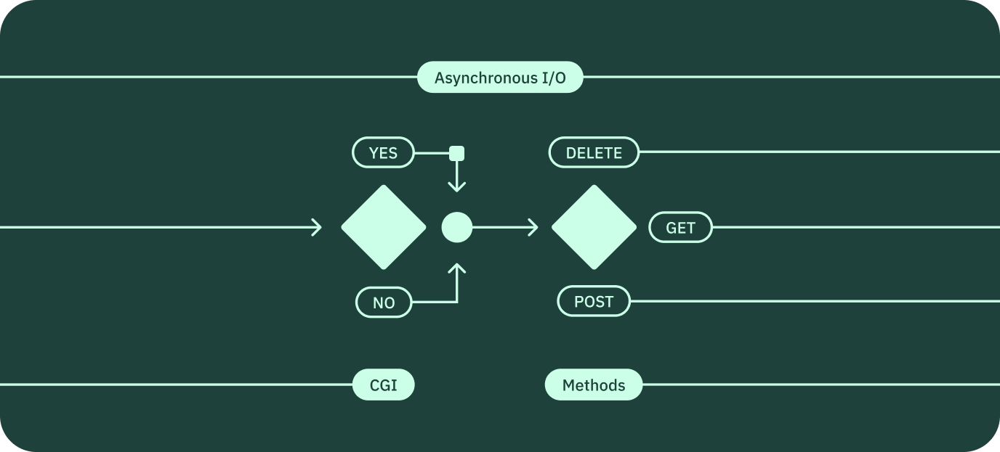

*This project has been created as part of the 42 curriculum in collaboration with [Sergej Gavrilov](https://github.com/Kopfdreher).*

# webserv



## Table of contents

- [Description](#description)
- [Configuration file](#configuration-file)
- [CGI Implementation](#cgi-implementation)
- [How to run](#how-to-run)
- [Resources](#resources)

## Description

HTTP web server built from scratch in C++98.

It handles multiple connections using `epoll`, which is Linux-only system call. In order to work on other operating systems, the program is containerized with Docker.

The server accepts only `GET`, `POST`, and `POST` requests and it can be used for serving static files and for handling CGI.

## Configuration file

The server requires a configuration file with extension `.conf` in order to run.

Its structure is inspired by **nginx** configuration file and defines the directives, which are instructions that tell the server how to handle incoming requests.

There are two types of directives:

- **block directive**: consists of a name and set of instructions surrounded my curly braces:

```conf
<block_directive_name> {
  <instructions>
}
```
- **simple directive**: consists of a name and one or more values separated by one space and followed by a semicolon:

```conf
<simple_directive_name> <value>;
```

### Block directives

- `global`

  It represent the top-level context. It is implicit, which means that the configuration file would not have `global {}`.

- `server`

  Can be defined only in `global`.

  At least one `server` directive must be defined.

- `location`

  Can be defined only in `server`. Between the name and the opening curly brace, an endpoint must be specified:

  ```conf
  location /about/ {
  }
  ```

  In this example, `/about/` is the endpoint of the `location` block directive.

  In order to be valid, the location must include a trailing `/`:

  - `location /about`  -> Invalid
  - `location /about/` -> Valid
  
  **Fallback location**: if `location /` is defined, it acts as fallback, which means that if a request endpoint does not match any other `location` block, the server will default to the `location /` block.

  ```conf
  location /about/ {
  }

  location / {
  }
  ```

  With the above configuration:
  - `http://<hostname>/home`   -> `location /` block
  - `http://<hostname>/about/` -> `location /about/` block

In order to be valid, the closing curly brace of a block directive must be in a different line than the opening curly brace.

This is invalid:

```conf
server {}
```

This is valid:

```conf
server {
}
```

### Simple directives

- `root`

  It determines the directory from which static files will be served. 

  It can be defined at any scope. 

  If not defined, it is set to `www`.

  If multiple definition are present in the same block directive, the last one is applied.

- `index`

  It determines the default file to serve.

  It can be defined at any scope.

  If not defined, it is set to `index.html`.

  If multiple definition are present in the same block directive, the last one is applied.

- `listen`

  It determines a port that a server listens from.

  It can be defined only inside a `server` block.

  If not defined, the program will exit with `[ERROR] No port specified`.

  Multiple definitions are allowed in the same block directive.

- `cgi_script`

  It defines the script that will handle the request.

  It can be defined only inside a `location` block.

- `methods`

  It defines the methods that are allowed.

  It can be defined in any block and it can accept multiple values.

- `client_max_body_size`

  It defines the maximum body size of the request.

  It can be defined in any block.

- `autoindex`

  If set to true, lists the directory files.

  By default, is set to false.

  It can be defined in any block.

- `redirect`

  Redirects to the specified location.

  It can be defined only in `location`.

- `errors_root`

  Defines from where to serve the error files.

  By default, is set to `www/errors`.

  It can be defined in any block.

  

### Simple web server

The configuration file of a simple web server would look like this:

```conf
server {
  listen 1024;

  location / {
  }
}
```

This will start the server with a single `server` block listening at port `1024`. `root` is set to `www` and `index` to `index.html`. The fallback `location /` allows the server to handle requests with any `endpoint`, which will be appended to `root`.

Some examples:

| Request                          | File served           |
|----------------------------------|-----------------------|
| `http://localhost:1024`          | `www/index.html`      |
| `http://localhost:1024/about/`   | `www/about/index.html`|
| `http://localhost:1024/file.txt` | `www/file.txt`        |


## HTTP request endpoints

HTTP request endpoints are normalized by appending `/` if the endpoint does not contain any dot (`.`).

For this reason, endpoints with directory names that contain a dot (`.`) in their name must also include the trailing `/`.

The following HTTP request would not be interpreted correctly:

```bash
http://<ip>:<port>/directory.name
```

The endpoint would be interpreted as a file name and, if not found, the server will return `404`.

To solve this, simply add a trailing `/`:

```bash
http://<ip>:<port>/directory.name/
```

## CGI Implementation

### Config Syntax
```c++
location /cgi-bin {
    root ./www/cgi-bin;
    allow_methods GET POST;
    cgi_pass .php /usr/bin/php-cgi;
    cgi_pass .py /usr/bin/python3;
}
```

### URL (Uniform Resource Locator)

| URL | `http://` | `localhost` | `:8080` | `/cgi-bin/` | `folder/test.php` | `/extra/path` | `?` | `name=example` |
| --- | --- | --- | --- | --- | --- | --- | --- | --- |
| **Component** | `Protocol` | `Host` | `Port` | `Location` | `File in root` | `Path Info` |  | `Query` |
| **CGI Variable** | `REQUEST_SCHEME` | `SERVER_NAME` | `SERVER_PORT` | `SCRIPT_NAME` | `SCRIPT_NAME` | `PATH_INFO` |  | `QUERY_STRING` |

---

### HTTP Header (Hypertext Transfer Protocol)

| HTTP Header | `POST` | `/cgi-bin/folder/test.php` | `/extra/path` | `?` | `name=example` | `HTTP/1.1` |
| --- | --- | --- | --- | --- | --- | --- |
| **CGI Variable** | `REQUEST_METHOD` | `SCRIPT_NAME` | `PATH_INFO` |  | `QUERY_STRING` | `SERVER_PROTOCOL` |

### Important "Hidden" Variables

- `CONTENT_LENGTH`: in HTTP-Header as `Content-Length`
- `CONTENT_TYPE`: in HTTP-Header as `Content-Type`
- `PATH_TRANSLATED`: `root` + `PATH_INFO`

### Mandatory Core Variables

| Variable | Source |
| --- | --- |
| `GATEWAY_INTERFACE` | `CGI/1.1` |
| `SERVER_PROTOCOL` | `HTTP/1.1` |
| `SERVER_SOFTWARE` | `42webserv/1.0` |
| `REQUEST_METHOD` | `GET` or `POST` |
| `QUERY_STRING` | Everthing after `?` |
| `CONTENT_LENGTH` | From Headers if `POST` |
| `CONTENT_TYPE` | From Headers if `POST` |
| `SCRIPT_NAME` | path including `.file` |
| `SCRIPT_FILENAME` | `root` + `SCRIPT_NAME` |
| `PATH_INFO` | trailing path after `.file` |
| `PATH_TRANSLATED` | `root` + `PATH_INFO` |
| `REDIRECT_STATUS` | `200` |

## How to run

Clone the repository:

```bash
git clone https://github.com/s-gas/webserv
```

Change to the project directory:

```bash
cd webserv
```

### Through binary file

Create the executable via the `Makefile`:

```bash
make
```

Run the program passing as argument the configuration file:

```bash
./webserv <configuration_file>
```

### Through Docker

Create the Docker image:

```bash
docker build -t webserv:1 .
```

Run the container:

```bash
docker run --rm -d -p <host_port>:<container_port> --name webserv webserv:1
```

This will run the program with `conf-files/webserv.conf` as argument.

### Flags used

| Flag   | Description                                        |
|--------|----------------------------------------------------|
| --rm   | Automatically remove the container when it exits   |
| -d     | Run container in background and print container ID |
| -p     | Publish a container's port(s) to the host          |
| --name | Assign a name to the container                     |

## Resources

[Nginx Documentation](https://nginx.org/en/docs/)

[MDN HTTP](https://developer.mozilla.org/en-US/docs/Web/HTTP)

### AI Usage

AI (Claude) was used mainly for clarifying the concepts read in the documentation.

[Back to top](#webserv)
