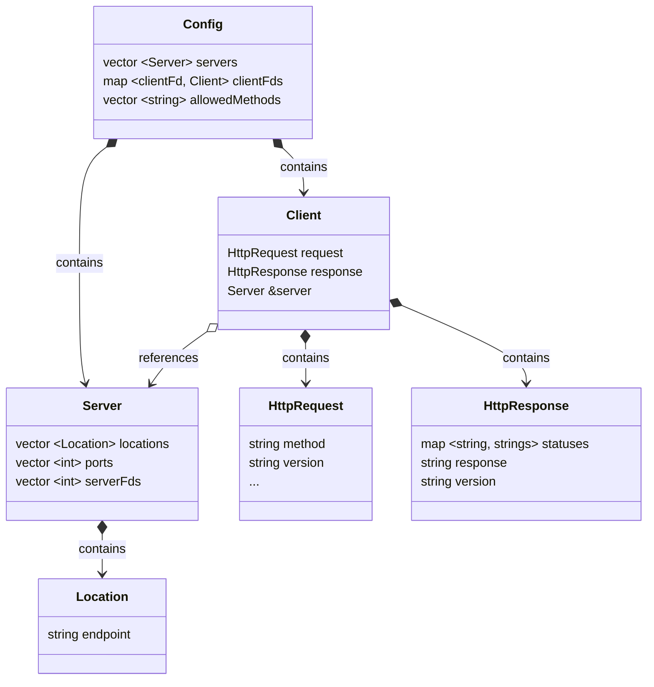

```mermaid
classDiagram
 class Config {
    vector ~Server~ servers
    map ~clientFd, Client~ clientFds
    vector ~string~ allowedMethods
 }
 class Server {
    vector ~Location~ locations
    vector ~int~ ports
    vector ~int~ serverFds
 }
 class Location {
    string endpoint
 }
 class Client {
    HttpRequest request
    HttpResponse response
    Server &server
 }
 class HttpRequest {
    string method
    string version
    ...
 }
 class HttpResponse {
    map ~string, strings~ statuses
    string response
    string version
 }

 Config *--> Server : contains
 Config *--> Client : contains
 Server *--> Location : contains
 Client *--> HttpRequest : contains
 Client *--> HttpResponse : contains
 Client o--> Server : references
```
